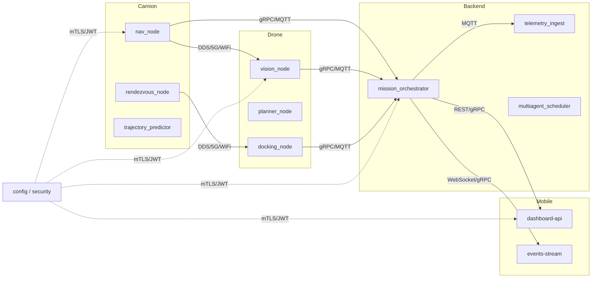

# Architecture haut niveau

## Story
- En tant qu’architecte système, je veux une architecture haut niveau claire pour marquer les flux et les points de responsabilité.
- Critère d’acceptation : diagramme logique, rôles, flux de données, contraintes et risques documentés.

## Diagramme logique
- Camion autonome <-> Drones (DDS/5G/Wi-Fi)
- Camion + Drones <-> Backend cloud (gRPC/MQTT)
- Backend <-> Application mobile (REST/gRPC)
- Orchestrateur multi-agents dans backend

## Rôles
- Camion: navigation continue, points de rendez-vous, collecte, trémie
- Drones: détection / ramassage / rendez-vous / dépôt
- Backend: planification, exploitation, télémétrie, sécurité
- Mobile: supervision, alertes, opérations utilisateur
- Orchestrateur: assignation, prédiction, gestion de conflit

## Flux de données
- Télémétrie haute fréquence (10 Hz)
- Commandes de mission 1 Hz–10 s
- Événements sécurité et journalisation vers backend

## Contraintes critiques
- Latence < 100 ms rendez-vous
- Disponibilité >= 99.9%
- Sécurité : mTLS, JWT, IAM
- Scalabilité multi-drones

## Modules logiciels
- Camion: nav_node, rendezvous_node, trajectory_predictor
- Drones: vision_node, planner_node, docking_node
- Backend: mission_orchestrator, telemetry_ingest
- Mobile: dashboard, notifications

## Risques & atténuation
- Perte réseau -> mode dégradé + cache
- Erreur docking -> fallback dépose + retry
- Collisions -> E-STOP, geo-fencing
- Sécurité -> rotation clés, audit

## Profils QoS ROS2

| Topic | Reliability | Durability | History Depth | Deadline |
|-------|-------------|------------|---------------|----------|
| /truck/position | BEST_EFFORT | VOLATILE | 1 | 100ms |
| /drone{ID}/position | BEST_EFFORT | VOLATILE | 1 | 100ms |
| /truck/command | RELIABLE | TRANSIENT_LOCAL | 10 | 1s |
| /drone{ID}/mission | RELIABLE | TRANSIENT_LOCAL | 10 | 1s |
| /rendezvous/plan | RELIABLE | TRANSIENT_LOCAL | 100 | 100ms |
| /telemetry/* | BEST_EFFORT | VOLATILE | 1 | 100ms |

## DDS-Security
- Activation native via fichier `dds_security.xml`
- Enrollment auto des nœuds via CA certificates
- Permissions granulaires par namespace (camion, drone, backend)

## Architecture Edge pour Synchronisation Critique
```
Camion (DDS) ←→ Drone (DDS)     ←─ Chemin temps réel critique
     ↓                                  (pas de cloud)
Bridge DDS → Cloud (analytics)   ←─ Chemin analytique
```

## Plan d’action séquentiel (Playbook 02)
1. Documenter chaque interface et protocole (camion/drone/backend/mobile).
2. Valider les SLA & contraintes (latence, disponibilité, sécurité) avec l’équipe DevOps.
3. Faire la revue d’architecture avec les stakeholders (sécurité, operations, QA).
4. Définir preuves de concept pour flux critiques (rendement rendez-vous dynamique, télémétrie 10Hz).
5. Revue finale, ajustement, handoff vers implémentation.

## Diagramme Mermaid (Playbook 02)


## Conception détaillée (Playbook 02)
### 1) Architecture des composants (détails)
- Camion
  - `nav_node`: ROS2 node, réception trajectoire, estimation temps d’arrivée. Sortie pose, vitesse.
  - `rendezvous_node`: recalcul d’emplacement de rendez-vous, synchronisation drone, décisions E-STOP.
  - `trajectory_predictor`: prédictif (kalman+ML) du trajet futur 30s.
- Drone
  - `vision_node`: détection objet via caméra (YOLOv8), segmentation et classification.
  - `planner_node`: ROS2 action server, plan de route vers cible puis point de rendez-vous.
  - `docking_node`: contrôleur comportement pour l’atterrissage/dépose intégrant PID et IR sensors.
- Backend
  - `mission_orchestrator`: microservice gRPC, stocke goals, affectations, ré-optimisation.
  - `telemetry_ingest`: ingestion MQTT <-> base TS (InfluxDB/Timescale).
  - `multiagent_scheduler`: composant sur le routeur workflow avec objectif minimiser ETA + charge.
- Mobile
  - `dashboard-api`: REST CRUD mission/statuts
  - `events-stream`: WebSocket/gRPC streaming alertes et télémetrie synthétique.

### 2) Contrats API et protocoles
- Camion <-> Backend
  - gRPC mission_status, rendezvous_request, position_update
  - MQTT `telemetry/camion/{id}` 10Hz: {lat,lng,heading,speed,batt,status}
- Drone <-> Backend
  - gRPC `DroneCommand/Status`, `DroneTelemetry`
  - MQTT `telemetry/drone/{id}` 10Hz, events `drone/{id}/incident`
- Camion <-> Drone
  - DDS ROS2 topics : `rendezvous/command`, `rendezvous/ack`, `pose/shared`
  - fallback 5G/HTTP JSON (ping + coords direct)
- Backend <-> Mobile
  - REST : /api/v1/missions, /api/v1/assets, /api/v1/alerts
  - gRPC stream : `MissionUpdate` 1Hz

### 3) Sécurité et confiance
- mTLS sur toutes les liaisons gRPC et DDS-auth.
- JWT scopes : `mission.read`, `mission.write`, `admin`.
- Rotate auto des clés toutes les 24H via Vault + audit logs.
- Hardening : firewall host, IPS, IPSec entre sous-réseaux.

### 4) Performance dynamique
- Architecture élastique : Kubernetes + HPA pour `telemetry-ingest` et `mission-orchestrator`.
- QoS ROS2: `reliable` pour rendez-vous, `best_effort` pour télémetrie très haute fréquence.
- Buffering local 5 min ; 1) commit sync à backend quand réseau récupère.

### 5) Scénarios de test et validation
- Test 1 : rendez-vous dynamique (camion + 2 drones) avec perturbation de 20% vitesse.
- Test 2 : perte réseau convoyage (10-30 s)  -> dégradé / reprise / coherency.
- Test 3 : sécurité mTLS invalid cert, accès interdit, rotation clés.
- Test 4 : montée en charge 50 → 250 drones (latence <100ms, oral métrique).

### 6) Artefacts de livraison
- Schémas Mermaid SDK + PlantUML via `docs/architecture/02-*`.
- Spécifications OpenAPI (interface backend mobile).
- Fiches techniques des nodes ROS2, fonctions de sécurité, SLA.
- Document de décision architecturale (ADR) autour du choix DDS/gRPC/MQTT.
