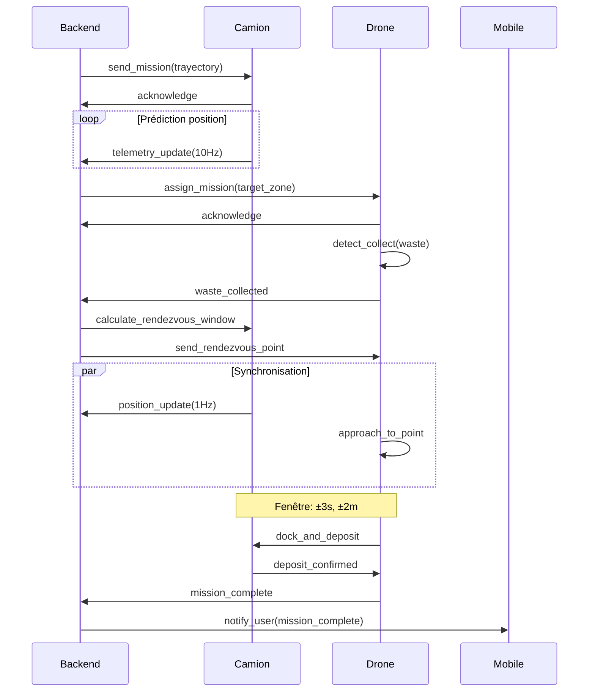

# Architecture fonctionnelle

## Story
- En tant que Product Owner, je veux des user stories des activités principales pour prioriser les développements fonctionnels.
- Critère d'acceptation : cas d'usage, flux, interactions, séquences, et conditions de succès sont décrits.

## Cas d'usage
1. Lancement mission
2. Ramassage déchets
3. Rendez-vous dynamique
4. Retour et recharge drone
5. Supervision mobile

## Flux opérationnels
- Backend planifie et assigne mission
- Drone détecte et collecte objets
- Camion reçoit timestamp + position projetée
- Rendez-vous dynamique et dépôt
- Retour de drone et reporting

## Protocole de Réservation de Rendez-Vous
Pour éviter le deadlock sur RV simultanés:
1. Drone requiert fenêtre RV → Backend alloue slot unique
2. Slot réservé avec timeout 30s
3. Si timeout → slot libéré, réassigne
4.ACK signé cryptographiquement par camion

## Acteurs et interactions
- Drone ↔ Orchestrateur (planning/état)
- Camion ↔ Orchestrateur (position projetée)
- Mobile ↔ Backend (statuts/incidents)

## Séquences temporelles
- T0 mission confirmée
- T+15s drone en route
- T+N rendez-vous camion
- T+N+5s dépôt
- T+N+10s confirmation

## Préconditions
- GPS valide, batterie suffisante (>=80%), autorisations de vol obtenues
- Réseau disponible (ou mode dégradé activé)
- Camion en route sur trajectoire规划

## Postconditions
- Déchet collecté, mission mise à jour, drone retour
- Telemetry confirmée en base de données
- Notification envoyée à l'opérateur

## Catalogue de Messages d'Erreur

| Code | Message Utilisateur | Action Recommandée |
|------|---------------------|-------------------|
| E001 | "Mission échouée: drone unreachable" | Vérifier signal drone, relancer |
| E002 | "Rendez-vous annulé: timeout" | Réassigner fenêtre RV |
| E003 | "Batterie drone critique (<15%)" | Retour immédiat à base |
| E004 | "Perte connexion camion" | Mode dégradé activé |
| E005 | "Collision détectée" | Arrêt d'urgence immédiat |
| E006 | "Capteur défaillant" | Basculement-capteur backup |

## Contrôles d'Urgence Mobile
- **Bouton STOP** : Arrêt immédiat tous drones
- **Reprise manuelle** : Contrôle direct drone via joystick virtuel
- **Mode pause** : Suspendre mission temporairement

## Matrice de Traçabilité Exigences → Tests

| Exigence | UC | Critère | Test |
|----------|-----|---------|------|
| REQ-UC001-001 | UC-001 | Taux collecte >90% | TestCharge_01 |
| REQ-UC002-001 | UC-002 | Confiance détection >85% | TestDetection_01 |
| REQ-UC003-001 | UC-003 | Latence RV <100ms | TestRV_Perf_01 |
| REQ-UC004-001 | UC-004 | Batterie >40% retour | TestBattery_01 |
| REQ-UC005-001 | UC-005 | Latence mobile <1s | TestMobile_01 |

## Justification des Seuils
- **85% confiance détection**: Issue de tests YOLO sur dataset WasteNet v1.0
- **40% batterie retour**: Marge de sécurité pour retour sans incident
- **15% batterie critique**: Seuil permettant 3min vol urgence
- **Latence <100ms**: Contrainte DDS实测 en milieu urbain 5G

## Plan d'action séquentiel (Playbook 03)
1. Traduire chaque cas d'usage en user stories avec critères Acceptance (Given/When/Then).
2. Implémenter les flux opérationnels par composant (Orchestrateur, Camion, Drone, Backend, Mobile).
3. Définir scénarios de tests e2e et fuzz pour les points de rendez-vous dynamique.
4. Prioriser backlog pour MVP avec versionnage (v0.1->v1.0).
5. Exécution des tests et retour en rétroaction sur la roadmap.

## Diagramme de Séquence (Example: Rendez-vous dynamique)

