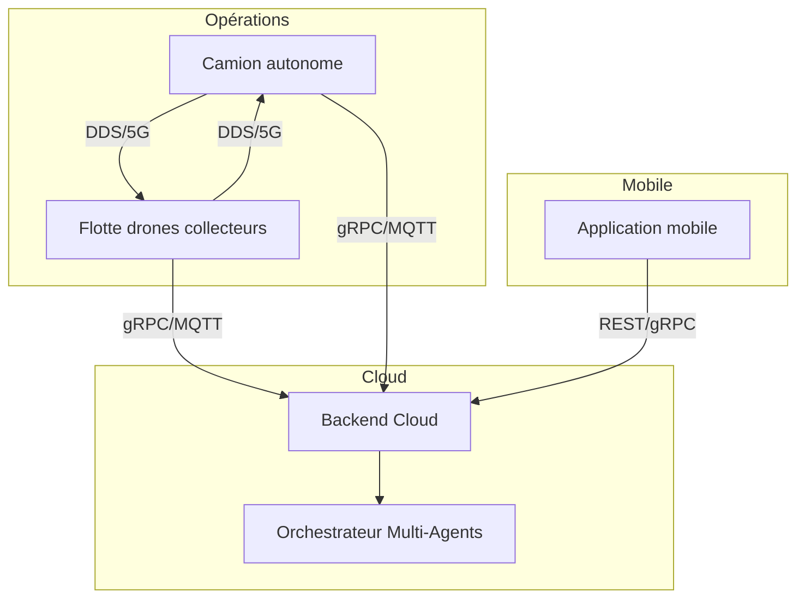

# Diagramme Mermaid haut niveau

## Story
- En tant que stakeholder, je veux un diagramme visuel synthétique du système pour comprendre rapidement l’architecture.
- Critère d’acceptation : diagramme Mermaid complet avec flux entre camion, drones, backend et mobile.

